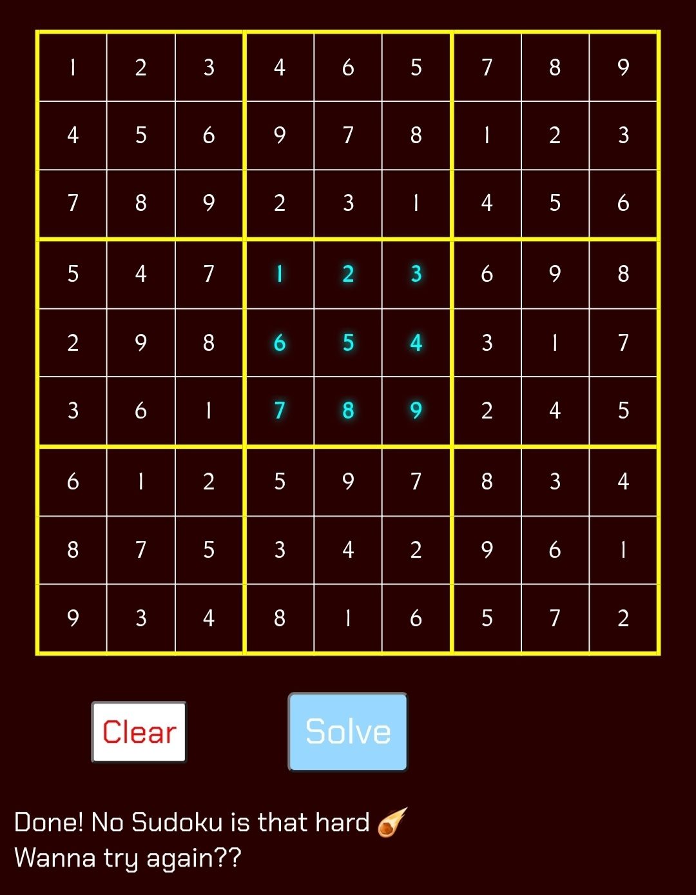

# Sudoku Solver 🧩

A web-based project to solve Sudoku puzzles using a **SAT Solver** and **Web Worker**.  
The goal is to run heavy computations on a separate thread so the UI remains smooth and responsive.

---

    

## 💡 Why This Project Matters
Sudoku is more than a puzzle — it’s a structured constraint-satisfaction problem.
This project shows how a classic game can be solved using SAT solving, CNF encoding, and Web Workers inside the browser.
- Demonstrates how real problems can be modeled as logical formulas
- Uses a SAT solver instead of handcrafted Sudoku logic
- Runs heavy computation in a Web Worker to keep the UI responsive
- Shows clean separation between UI, CNF generation, and solving logic
- A practical example of algorithmic thinking inside modern JavaScript

This project is both a learning resource and a demonstration of how powerful the browser can be as a computational platform.

---

## 📂 Project Structure
- `index.html` → Main user interface
- `src/sudoku.js` → Builds the Sudoku grid and handles events
- `src/solver-worker.js` → Runs the solver in a Web Worker
- `src/solver/sat-solver.js` → SAT Solver algorithm for Sudoku

---

## 🛠 Requirements
- Modern browser with ES Modules and Web Worker support
- Simple local or hosting server
- No external libraries (Vanilla JS only)

---

## 🚀 How to Run
1. Launch a simple local server (e.g., `python -m http.server` or `php -S localhost:[port]`).  
   > Reason: Web Workers and ES Modules require proper MIME types.
2. Open the project in a modern browser (Chrome, Firefox, Edge, etc.).
3. Fill in the Sudoku grid and click **Solve**.

---

## ⚙️ Features
- 9×9 Sudoku grid with input restricted to digits 1–9
- Edit the board and retry without clearing the entire grid.
- **Clear** button to reset the grid
- Uses **Web Worker** to prevent UI blocking
- SAT Solver algorithm for fast and accurate solutions
- Status messages (Solved ✅ / Invalid ❌)
- Alerts when the project is not running on a server or JavaScript is not supported.
- Live UI with animations and enhanced text selection.

---

## 🧠 Algorithm Overview
- Sudoku rules are encoded into CNF (Conjunctive Normal Form); covering cell, row, column, and block constraints.
- The SAT Solver uses techniques such as Unit Propagation, Watched Literals optimization, and VSIDS scoring to find a solution.
- The final solution is returned as a 9×9 matrix and displayed in the grid.

---

## 🔮 Future Improvements
- Optional step-by-step solving visualization (user can enable or disable)
- Option to generate random valid Sudoku solutions
- Performance optimizations for harder Sudoku puzzles
